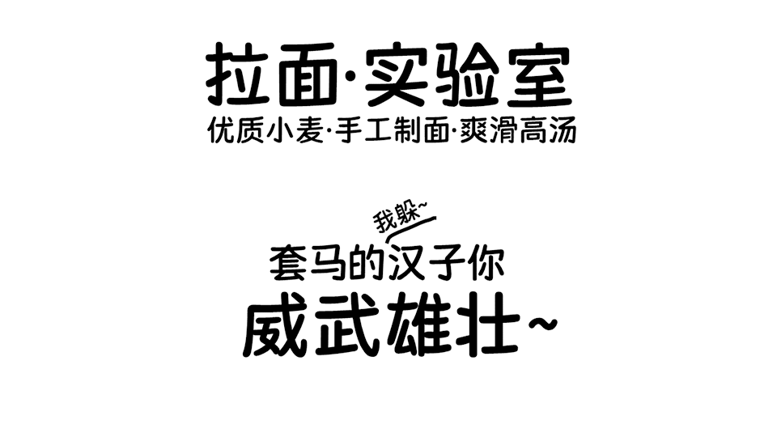

# Kingnam Maiyuan 荆南麦圆体

## 声明 Declaration

**本字体不是我（@NightFurySL2001）的字体成品。本字体为荆南字库（Kingnam Type Foundry）的字体成品，透过[委托书](./documentation/%E5%A7%94%E8%A8%97%E6%9B%B8.pdf)授予本人（@NightFurySL2001）权力转发字体以供上传 Google Fonts。**  
**This font is not a product from me (@NightFurySL2001). This is a font product of Kingnam Type Foundry (荆南字库), which has authorized me (@NightFurySL2001) through the [Letter of Authorization](./documentation/%E5%A7%94%E8%A8%97%E6%9B%B8.pdf) to be redistributed for providing the font to Google Fonts.**

## 字体特点 Font speciality
荆南字坊麦圆体的设计灵感来源于韩国的一个综艺节目上的谚文字体，手写的风格圆润的笔画让这款字体看起来很可爱。

麦圆体萌系可爱的手写风格，字体每个笔画的粗细相同，两端圆润饱满，凸显可爱风格。虽是手写字体，笔画分明没有细小的连接，使字体更加清新俏皮。无论是做食品类还是母婴类，抑或是儿童类的设计都特别适合。

横画略偏斜，日字不封口，接近手写特征尾端圆润，横竖均一，保留趣味性的同时可读性高，也能适应屏幕显示。

## 授权 License

本字体以 SIL 开源字型授权，版本 1.1 发布。  
This font is licensed under SIL Open Font License, version 1.1.

## 制作字体 Building the font

请运行 `./sources/build.bat`。需要安装 `fontmake`。  
Please run `./sources/build.bat`. Requires `fontmake`.
